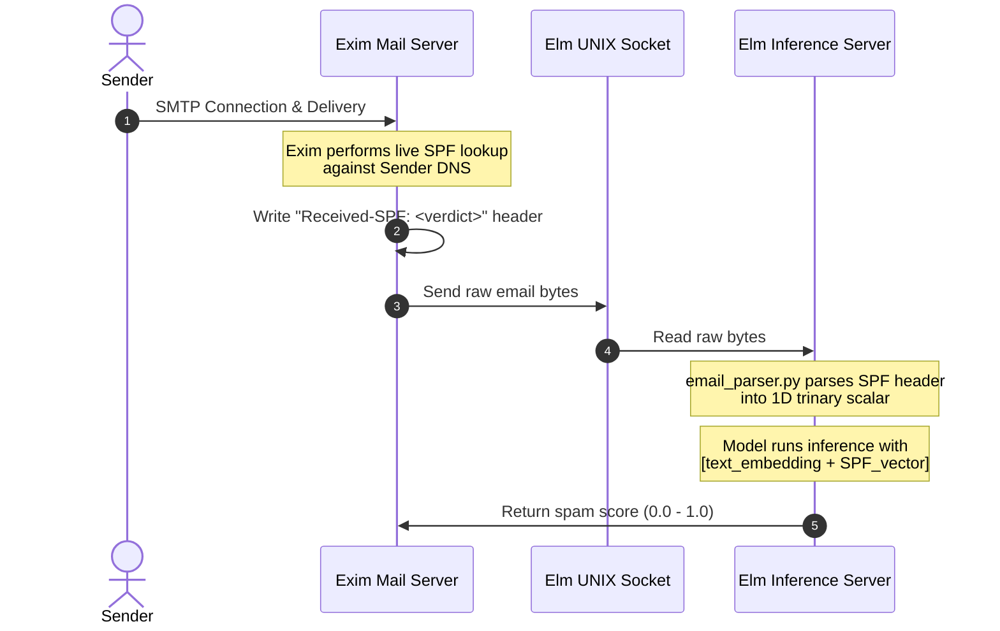

# Design Document: SPF (Sender Policy Framework) Metadata Feature

This document describes the architecture, data representation, and code blueprints for integrating SPF validation into the Elm Spam Classifier's tabular metadata features (`metadata_features`).

> [!WARNING]
> **Prerequisite: Wait for SPF-Tagged Corpus Accumulation**
> Because Exim SPF tagging was only enabled today, almost all historical training emails in your existing mailboxes will lack the `Received-SPF` or `Authentication-Results` headers. 
> 
> Training the model on this dataset immediately would result in the parser assigning `0.0` (missing/neutral) to almost every historical sample. The model would learn a weight of near-zero for SPF and fail to gain any predictive value from it. 
> 
> **Recommendation:** Wait to implement this feature and train the model until you have collected a sufficiently large corpus of new incoming emails (both ham and spam) that contain the Exim-stamped SPF headers.

---

## 1. Architectural Rationale

To detect email spam effectively, incorporating sender authentication status (such as SPF) provides highly reliable, non-textual signals. However, checking SPF at preprocessing/inference time has severe architectural drawbacks:

1. **DNS Drift (The Historical Training Problem):** When training on historical email archives (e.g., Maildirs delivered months or years ago), doing a live SPF check today will query *today's* DNS records. If the domain changed its SPF policy, expired, or changed IP addresses, the live SPF check would return an incorrect result. This introduces severe train-serving skew and noise into the training labels.
2. **Missing SMTP Context:** An offline email file does not natively store the connecting SMTP client IP address or the envelope sender (`Return-Path`), both of which are required to run an SPF check. Extracting them post-delivery from nested `Received` headers is fragile and vulnerable to spoofing.
3. **Efficiency:** Live DNS queries during model inference block the server and add unnecessary latency.

### The Solution: Delivery-Time Tagging

The Mail Transfer Agent (MTA)—in our case, **Exim**—performs the SPF check live during the SMTP transaction when it has direct access to the client socket and envelope. Exim stamps the verdict into a standard header (such as `Received-SPF` or `Authentication-Results`). 

Elm then simply extracts this header at preprocessing time. This ensures **zero train-serving skew** and 100% time-consistent features during offline training on old emails.



---

## 2. Data Representation

To keep the representation clean, compact, and free of invalid/impossible states, we represent the verdict as a **single trinary scalar value** in a single-element list in `metadata_features`.

The list structure is defined as:
`[spf_verdict]`

### Mapping Table

| SPF Verdict | Scalar Value | Meaning / Rationale |
| :--- | :--- | :--- |
| **`pass`** | `[1.0]` | Connecting IP is explicitly authorized. Strongly indicative of ham. |
| **`neutral`** / **`none`** / **error** / **missing** | `[0.0]` | No SPF record found, or policy is informational (`?all`). Treated as the neutral baseline. |
| **`fail`** / **`softfail`** | `[-1.0]` | Connecting IP is explicitly unauthorized or transitioning (`~all`). Strongly indicative of spam. |

---

## 3. Implementation Blueprints

### 3.1. Core Parser: `core/email_parser.py`

The parser must search for both our custom `X-SPF-Status` header and standard RFC-compliant headers:
- `X-SPF-Status` (from custom Exim configurations)
- `Received-SPF` (RFC 7208)
- `Authentication-Results` (RFC 8601)

#### Blueprint Change:
```python
import re

def get_spf_features(msg) -> list[float]:
    """Parses Received-SPF, Authentication-Results, or X-SPF-Status headers and returns a single-value list:
    [1.0] if pass, [-1.0] if fail/softfail, [0.0] if neutral/none/missing
    """
    verdict = "none"
    
    # 1. Inspect custom X-SPF-Status first (useful for our local Exim configuration)
    x_spf = msg.get("X-SPF-Status")
    if x_spf:
        candidate = x_spf.strip().lower()
        if candidate in ["pass", "fail", "softfail", "neutral", "none"]:
            verdict = candidate
            
    # 2. Inspect Received-SPF headers (RFC 7208)
    if verdict == "none":
        spf_headers = msg.get_all("Received-SPF")
    if spf_headers:
        for header in spf_headers:
            # Extract first word, e.g. "pass", "fail", "softfail", "neutral", "none"
            m = re.match(r"^\s*([a-zA-Z]+)", header)
            if m:
                candidate = m.group(1).lower()
                if candidate in ["pass", "fail", "softfail", "neutral", "none", "temperror", "permerror"]:
                    verdict = candidate
                    break
                    
    # 2. Fallback to Authentication-Results headers (RFC 8601)
    if verdict == "none":
        auth_headers = msg.get_all("Authentication-Results")
        if auth_headers:
            for header in auth_headers:
                m = re.search(r"\bspf\s*=\s*([a-zA-Z]+)", header, re.IGNORECASE)
                if m:
                    candidate = m.group(1).lower()
                    if candidate in ["pass", "fail", "softfail", "neutral", "none", "temperror", "permerror"]:
                        verdict = candidate
                        break

    # Map the verdict to a single-element list with a trinary scalar
    if verdict == "pass":
        return [1.0]
    elif verdict in ["fail", "softfail"]:
        return [-1.0]
    else:
        # neutral, none, temperror, permerror, or completely missing
        return [0.0]
```

This list must be returned in the parsed record dictionary as the `metadata_features` key:
```python
def parse(raw_email_bytes: bytes, label: int = 0) -> dict:
    ...
    return {
        "subject": subject,
        "body": body,
        "metadata_features": get_spf_features(msg),
        "label": label
    }
```

### 3.3. MTA Integration (Exim4 Configuration Reference)

To add the custom `X-SPF-Status` header on incoming mail in Exim4, place the following configuration block inside the standard data-stage ACL (such as `acl_smtp_data`). Note that this requires the `spf-tools-perl` package (on Debian/Ubuntu-based distributions) to provide the `/usr/bin/spfquery` binary:

```exim
# 1. Run the check on every inbound mail and store the raw text result
warn
  condition   = ${if and{{def:sender_host_address}{def:sender_address_domain}}}
  set acl_m_spf_status = ${run{/usr/bin/spfquery --ip $sender_host_address --scope mfrom --identity $sender_address}\
                           {$value}\
                           {error}}

# 2. Extract the clean status word and add the header to all messages
warn
  condition   = ${if def:acl_m_spf_status}
  # Clean up the output to find standard words: pass, fail, softfail, neutral, none
  set acl_m_spf_clean = ${if match{$acl_m_spf_status}{\N(?i)(pass|fail|softfail|neutral|none)\N}{$1}{unknown}}
  add_header  = X-SPF-Status: $acl_m_spf_clean
  log_message = SPF Result Logged: $acl_m_spf_clean
```

---

## 4. Ingestion and Training Workflow

When training the model:
1. **Ingest Phase:** `bazel run //training:ingest` parses historical mail directories. Because Exim previously delivered these emails and stamped them with `Received-SPF` headers, `ingest.py` writes these historic delivery-time features into `training.jsonl`.
2. **Train Phase:** `bazel run //training:train` automatically discovers that `metadata_features` has a dimension of 1. It concatenates the single feature to the `384` text embeddings, training a Logistic Regression model on a total of `385` features.
3. **Config Export:** `train.py` saves `metadata_dim: 1` in `metadata_config.json`.
4. **Deploy/Serve Phase:** The server reads `metadata_config.json`, expects 1 metadata feature, extracts it from incoming emails, and gets zero-skew predictions in production.

---

## 5. Alternatives Considered

During the design process, several alternative representations and architectures were evaluated:

### 1. Multi-Dimensional One-Hot Encoding (One feature per state)
* **Design:** Representing SPF as a 3D or 4D one-hot vector (e.g., `[is_pass, is_fail_or_softfail, is_neutral_or_missing]`).
* **Why Rejected:** While standard for categorical inputs, this representation makes invalid states expressible in the vector space (for example, `[1.0, 1.0, 0.0]`, which represents both a pass and a fail simultaneously). Although the parser code itself would never produce such states, it adds unnecessary complexity and dimension overhead (3 features instead of 1).

### 2. Binary Feature (0.0 for pass/neutral, 1.0 for fail/softfail)
* **Design:** Treating all good and neutral states as `0.0`, and only flagging SPF failures as `1.0`.
* **Why Rejected:** Grouping SPF `pass` (securely authenticated) together with SPF `none` (unauthenticated domain with no SPF records) removes highly valuable signal. In modern email filtering, a valid SPF `pass` is a strong signature of legitimacy (ham), whereas `none` is a common signature of spam or disposable domains. Conflating them prevents the model from rewarding successful authentication.

### 3. Elm performing live DNS SPF checks
* **Design:** Elm performing live DNS SPF checks against the sender's domain on incoming emails during training and inference.
* **Why Rejected:** Severe time-drift issues. Running live SPF checks on old emails during offline training would query *today's* DNS records rather than delivery-time records (which might have changed or expired years ago). Additionally, doing live DNS queries at serving time introduces blocking socket latency and requires complex, spoofable header parsing to reconstruct the original connecting IP.
