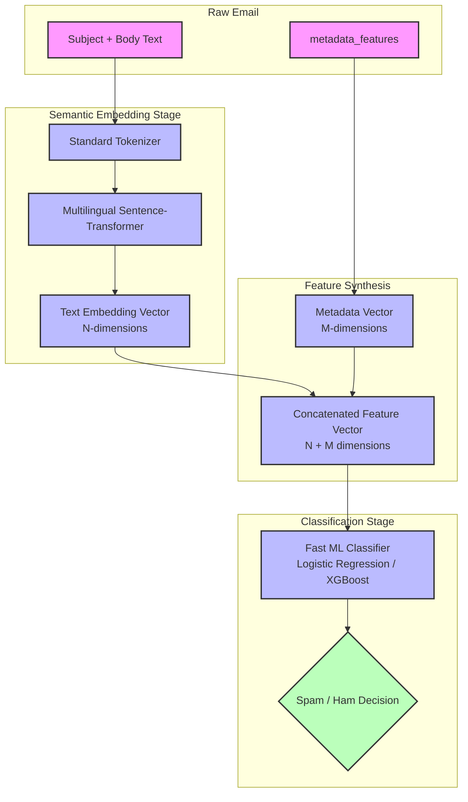

# Spam Detection Pipeline Design: Multilingual Embeddings + Metadata Classifier (PoC v1)

This document describes the design and implementation workflow for the email spam detection system. The model is specifically optimized to be highly accurate across multiple languages while remaining lightweight enough to perform near-instantaneous inference on a Raspberry Pi.

---

## 1. Architectural Overview (Approach A)

To run a deep-learning-based natural language processing model on edge hardware like a Raspberry Pi, we decouple **semantic understanding (text embeddings)** from **classification logic**.

We utilize a two-stage hybrid architecture:
1. **Pretrained Semantic Embedder**: We use a tiny, highly optimized multilingual sentence transformer to convert unstructured email text (Subject + Body) into a dense, fixed-size numerical vector.
2. **Tabular Classifier**: We concatenate the semantic text vector with structured email metadata features (like SPF, DKIM, and attachment metrics) and pass the combined feature vector into a fast classifier (Logistic Regression or XGBoost).

---

## 2. Key Components

### 2.1 Multilingual Semantic Embedder
- **Model**: `sentence-transformers/paraphrase-multilingual-MiniLM-L12-v2` or `intfloat/multilingual-e5-small`.
- **Reasoning**: It natively supports robust multilingual text representation, captures high-level semantic context, has only ~22M-33M parameters, and has a very small memory footprint.
- **Output**: Generates a 384-dimensional vector from the subject and body.

### 2.2 Structured Metadata Integration (The Concatenation Method)
The raw dataset contains a `metadata_features` field. This is used to capture structural markers not preserved in the text body itself.
* **Extraction**: Features such as `spf_pass (0/1)`, `dkim_pass (0/1)`, `dmarc_pass (0/1)`, `attachment_count`, and `links_count` are encoded into a dense 1D vector of size $M$.
* **Synthesis**: The 384-dimensional semantic text vector is concatenated directly with the $M$-dimensional metadata vector:
  $$\vec{x}_{\text{final}} = \big[ \vec{v}_{\text{embedding}} \,\|\, \vec{v}_{\text{metadata}} \big]$$
* **Result**: A single unified vector that represents both what the email *says* and how the email *arrived*.

### 2.3 The Fast Tabular Classifier
We train a fast machine learning model on top of $\vec{x}_{\text{final}}$:
- **v1 Proof of Concept**: **Logistic Regression** (L2-regularized) or **Linear SVM**. This trains in seconds, has a tiny disk footprint (kilobytes), and executes predictions via simple vector dot products (fractions of a millisecond).
- **Future v2 Upgrade**: **XGBoost** or **LightGBM** to learn complex non-linear combinations of text meaning and delivery security (e.g., highly suspicious spam-like text is flagged *only* when the email also has a failed SPF status).

---

## 3. Raspberry Pi Optimization & Deployment Strategy

To ensure zero CPU strain and low latency on Raspberry Pi hardware (ARM64), the pipeline employs two core optimizations:

### 3.1 ONNX Compilation
We do not install heavy deep learning frameworks like PyTorch or TensorFlow on the Raspberry Pi. Instead:
- We export the multilingual sentence-transformer to **ONNX (Open Neural Network Exchange)**.
- We run inference using **ONNX Runtime** (`onnxruntime`), which is a lightweight, C++ optimized runtime designed specifically to achieve maximum inference speeds on edge CPUs.

### 3.2 INT8 Dynamic Quantization
Before deploying the ONNX model to the Pi:
- We apply **Post-Training INT8 Quantization** to the embedding network weights.
- This converts the floating-point weights (FP32) to 8-bit integers (INT8).
- **Benefits**:
  - Shrinks model size by **75%** (from ~134MB down to **~34MB**).
  - Speeds up inference by **2x to 4x** on ARM CPUs.
  - Minimizes memory footprint, keeping execution well within the Pi's standard RAM limits.

## 4. Dependencies

The Python pipeline utilizes standard ML and deployment libraries. These dependencies are automatically managed via a Bazel-wrapped local virtual environment:
- `sentence-transformers`: High-level library to easily extract dense text representations.
- `transformers`: Backing library for huggingface tokenizers and models.
- `scikit-learn`: Standard library for fast tabular machine learning classifiers (Logistic Regression, Random Forest).
- `joblib`: High-performance persistence library to save and load scikit-learn models.
- `onnx` & `onnxruntime`: Used to serialize models to an open standard and run high-performance CPU inference.
- `numpy`: Fast array manipulations and feature vector synthesis.

---

## 5. Implementation Steps Roadmap & Parameterization

To avoid hardcoded paths and make the pipeline reusable with future datasets, all tools are fully parameterized using command-line arguments (e.g., via `argparse`).

### 5.1 Pipeline Execution

1. **Step 1: Classifier Training (`train.py`)**
   - **Arguments**:
     - `--data-path` (Path to any training JSONL file, e.g., `data/20260606-0/training.jsonl`)
     - `--model-dir` (Directory to save the trained `.joblib` classifier and metadata definitions)
   - **Logic**: Loads data, extracts embeddings using SentenceTransformers, concatenates with metadata features, fits the classifier, and saves it.

2. **Step 2: ONNX Conversion & Quantization (`export_onnx.py`)**
   - **Arguments**:
     - `--output-dir` (Directory to output the quantized ONNX files)
   - **Logic**: Exports the text embedder backbone to ONNX and applies post-training dynamic INT8 quantization.

3. **Step 3: Pi-Optimized Inference Runner (`predict.py`)**
   - **Arguments**:
     - `--subject` (Email subject text)
     - `--body` (Email body text)
     - `--metadata` (JSON string or list of numeric metadata features, e.g. `"[0, 1, 3]"`)
     - `--onnx-path` (Path to the quantized ONNX model file)
     - `--classifier-path` (Path to the trained classifier `.joblib` file)
   - **Logic**: Uses only `onnxruntime` and `numpy` to generate embeddings, synthesize features, and execute the final classification.

